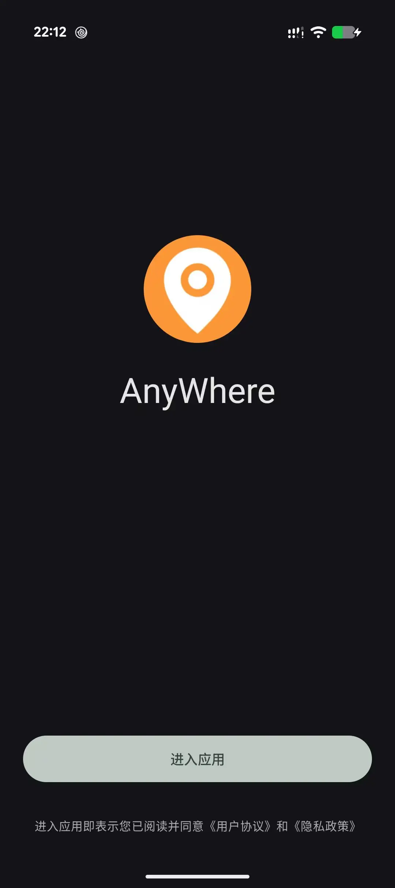
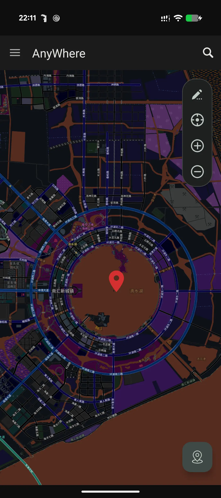

# AnyWhere

AnyWhere 是一款面向 Android 开发调试、功能测试与个人研究的位置环境模拟工具。

## 说明

当前版本的源码已迁移至私有仓库维护，开发、测试和本地签名构建均在私有仓库完成，
本仓库不再同步后续源码提交。请仅从本仓库的
[Releases](https://github.com/cxOrz/AnyWhere/releases) 页面下载正式版本。

## 功能概述

- 地图选点与坐标/IP定位
- 静止、移动位置模拟
- 在 LSPosed 中启用，以获得更好体验
- 更多高级功能自行探索...

## 预览

| 欢迎页面 | 地图主页 | LSPosed 设置 |
| :---: | :---: | :---: |
|  |  |  |

## 安装与使用

1. 从 [Releases](https://github.com/cxOrz/AnyWhere/releases) 下载适合设备架构的 APK；
2. 在系统“开发者选项”中，将 AnyWhere 设为模拟位置信息应用；
3. 启动应用并授予位置权限；仅在使用悬浮摇杆时需要悬浮窗权限；
4. 在地图中选择位置并开始模拟。

## 项目沿革

历史版本基于 [GoGoGo](https://github.com/cxOrz/GoGoGo) 构建。

当前 Release 私有版本已进行重构，不再沿用早期项目的架构。

## 免责声明

AnyWhere 仅供软件开发调试、功能测试和个人学习研究使用。严禁用于违反法律法规、
侵犯他人权益或违反第三方平台规则的行为，包括但不限于虚假考勤、游戏作弊与网络欺诈。

软件按“现状”提供，不保证在所有设备、Android 版本或第三方应用中具备完全一致的兼容性。
因违规使用造成的账号限制、服务中断、数据损失或法律责任，由使用者自行承担。

---

AnyWhere © 2026 cxOrz
